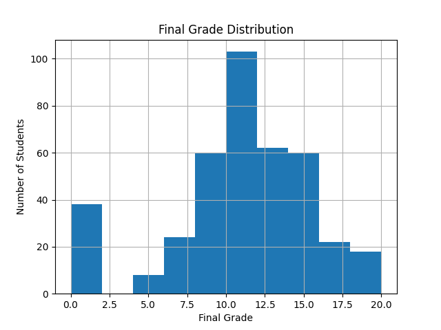
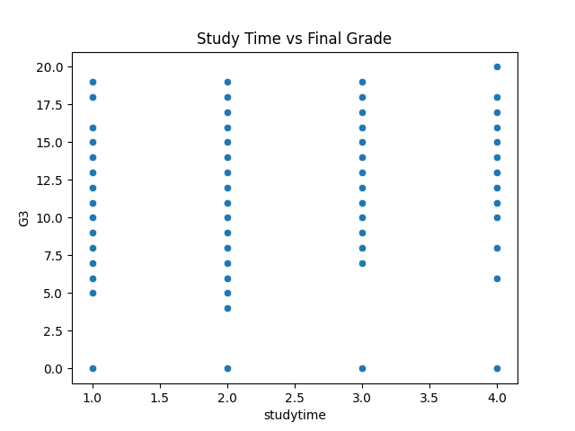

# Student Performance Prediction

## Project Overview

This project uses machine learning to predict students’ final grades (G3) based on academic performance and behavioral factors.

The goal is to identify key factors that influence student success and build a predictive model that estimates final grades with reasonable accuracy.

---

## Dataset

The dataset contains **395 student records** with **33 features**, including:

- Demographics (age, gender, address)  
- Family background  
- Study habits (study time, failures)  
- Attendance (absences)  
- Academic performance (G1, G2, G3)  

---
## Features Used

The model was trained using selected features that are most relevant to student performance:

- Study time  
- Number of past failures  
- Absences  

These features were chosen because they have a direct impact on academic outcomes.

---
## Results

The model was trained using Linear Regression to predict student final grades.

* Mean Squared Error (MSE): 19.87
* Root Mean Squared Error (RMSE): 4.46

This indicates that the model predicts student performance with an average error of approximately ±4.5 marks.  

The dataset is relatively small, which may limit model performance and generalization.

---
## Model Comparison

| Model              | RMSE |
|--------------------|------|
| Linear Regression  | 4.46 |
| Random Forest      | 4.34 |

The Random Forest model performed slightly better than Linear Regression, reducing prediction error. This suggests that capturing non-linear relationships improves performance, although the improvement is modest.

---
## Key Insights

* Students with more past failures tend to have lower final grades
* Increased study time generally improves performance
* Absences negatively impact student outcomes

---
## Visualizations

### Final Grade Distribution

### Study Time vs Final Grade

---

## Future Improvements

* Use more features from the dataset
* Apply advanced models (Random Forest, Gradient Boosting)
* Perform feature engineering
* Deploy the model as a web application

---
## Conclusion

This project demonstrates how machine learning can be used to predict student performance based on academic and behavioral factors.

While Linear Regression provides a solid baseline, the Random Forest model achieved slightly better accuracy by capturing more complex patterns in the data.

However, the improvement is modest, indicating that additional features and more advanced techniques may be needed for significantly better predictions.
